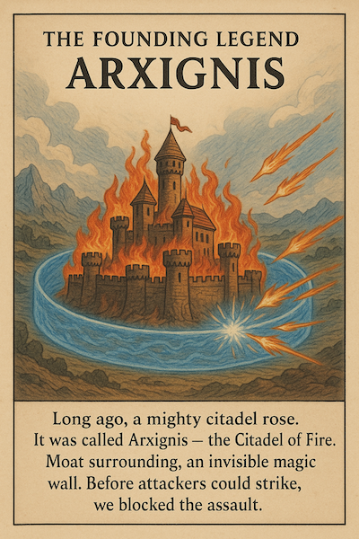

# Moat - Intelligent Reverse Proxy & Firewall

🌋 **The Legend of Arxignis and the Moat**

In the age of digital kingdoms, where empires rise and fall at the speed of code, there stands a fortress unlike any other — Arxignis, the Citadel of Fire.

Forged from lines of code and tempered by the flames of countless cyber battles, Arxignis was built for one purpose: to protect your realm.

But no fortress stands alone.

Surrounding Arxignis is Moat — not water, but an invisible, intelligent barrier that shifts and shimmers like living magic. It sees threats before they even know they exist. When invaders approach — bot armies, malicious payloads, or the darkest zero-day beasts — Moat awakens.

With a whisper of algorithmic incantation, it analyzes intent, bends logic, and casts away the unworthy.

Attackers see nothing but endless reflection — their own attacks bouncing back into the void. To them, it's as if your citadel never existed. To you, it's silent peace behind walls of flame and light.

Because this is your Citadel, your Arx, your Ignis.
And with Moat, the fire never reaches your gates. 🔥



## Overview

Moat is a high-performance reverse proxy and firewall built with Rust, featuring:

- **XDP-based packet filtering** for ultra-low latency protection
- **Automatic TLS certificate management** with ACME/Let's Encrypt integration
- **Threat intelligence integration** with Arxignis API
- **CAPTCHA protection** with support for hCaptcha, reCAPTCHA, and Cloudflare Turnstile
- **Redis-backed caching** for certificates and threat intelligence
- **Domain filtering** with whitelist and wildcard support
- **Environment variable configuration** for containerized deployments

## Quick Start

### Docker Build
```bash
docker build -t moat .
```

### Docker Run
```bash
docker run --cap-add=SYS_ADMIN --cap-add=BPF \
--cap-add=NET_ADMIN moat --iface eth0 \
--arxignis-api-key="your-key" --upstream "http://127.0.0.1:8081"
```

### Configuration File

Moat supports configuration via YAML files. Copy `config_example.yaml` to `config.yaml` and customize:

```bash
cp config_example.yaml config.yaml
```

The configuration file supports all features including:
- Server bind addresses and upstream configuration
- TLS modes (disabled, custom, ACME)
- ACME certificate management with Let's Encrypt
- Redis caching configuration
- Network interface and XDP settings
- Arxignis API integration
- CAPTCHA protection settings
- Domain filtering rules
- Logging configuration

### Environment Variables

All configuration options can be overridden using environment variables with the `AX_` prefix:

```bash
# Server configuration
export AX_SERVER_UPSTREAM="http://localhost:8080"
export AX_SERVER_HTTP_ADDR="0.0.0.0:80"
export AX_SERVER_TLS_ADDR="0.0.0.0:443"

# TLS configuration
export AX_TLS_MODE="acme"
export AX_TLS_ONLY="false"

# ACME configuration
export AX_ACME_DOMAINS="example.com,www.example.com"
export AX_ACME_CONTACTS="admin@example.com"
export AX_ACME_USE_PROD="true"

# Redis configuration
export AX_REDIS_URL="redis://127.0.0.1/0"
export AX_REDIS_PREFIX="ax:moat"

# Network configuration
export AX_NETWORK_IFACE="eth0"
export AX_NETWORK_DISABLE_XDP="false"

# Arxignis configuration
export AX_ARXIGNIS_API_KEY="your-api-key"
export AX_ARXIGNIS_BASE_URL="https://api.arxignis.com/v1"

# CAPTCHA configuration
export AX_CAPTCHA_SITE_KEY="your-site-key"
export AX_CAPTCHA_SECRET_KEY="your-secret-key"
export AX_CAPTCHA_JWT_SECRET="your-jwt-secret"
export AX_CAPTCHA_PROVIDER="turnstile"

# Domain filtering
export AX_DOMAINS_WHITELIST="trusted.com,secure.example.com"

# Logging
export AX_LOGGING_LEVEL="info"
```

## Command Line Options

### Basic Usage

```bash
moat [OPTIONS]
```

### Required Options

#### Arxignis Integration
- `--arxignis-api-key <KEY>` - API key for Arxignis service

### Network Configuration

#### Interface Configuration
- `--iface <INTERFACE>`, `-i <INTERFACE>` - Network interface to attach XDP program to (default: `eth0`)
- `--ifaces <INTERFACES>` - Multiple network interfaces for XDP attach (comma-separated)
- `--disable-xdp` - Disable XDP packet filtering (run without BPF/XDP)

#### Server Addresses
- `--control-addr <ADDRESS>` - HTTP control-plane bind address (default: `0.0.0.0:8080`)
- `--http-addr <ADDRESS>` - HTTP server bind address for ACME HTTP-01 challenges and regular HTTP traffic (default: `0.0.0.0:80`)
- `--http-bind <ADDRESSES>` - Additional HTTP bind addresses (comma-separated)
- `--tls-addr <ADDRESS>` - HTTPS reverse-proxy bind address (default: `0.0.0.0:443`)
- `--tls-bind <ADDRESSES>` - Additional HTTPS bind addresses (comma-separated)

### TLS Configuration

#### TLS Mode
- `--tls-mode <MODE>` - TLS operating mode (default: `disabled`)
  - `disabled` - No TLS, HTTP only
  - `custom` - Use custom certificates
  - `acme` - Automatic certificate management with Let's Encrypt
- `--tls-only` - Reject non-SSL requests (except ACME challenges) when TLS mode is disabled

#### Upstream Configuration
- `--upstream <URL>` - Upstream origin URL (always required)
  - Must be absolute URI (e.g., `http://127.0.0.1:8081`)
  - Used for forwarding requests in all TLS modes

#### Custom TLS Certificates
- `--tls-cert-path <PATH>` - Path to custom certificate (PEM) when using custom TLS mode
- `--tls-key-path <PATH>` - Path to custom private key (PEM) when using custom TLS mode

### ACME Configuration (Let's Encrypt)

#### Domain Management
- `--acme-domains <DOMAINS>` - Domains for ACME certificate issuance (comma separated or repeated)
- `--acme-wildcards <PATTERNS>` - Domain wildcard patterns for filtering (comma separated or repeated)
- `--acme-contacts <CONTACTS>` - ACME contact addresses (mailto: optional, comma separated or repeated)

#### ACME Settings
- `--acme-use-prod` - Use Let's Encrypt production directory instead of staging
- `--acme-directory <URL>` - Override ACME directory URL (useful for Pebble or other test CAs)
- `--acme-accept-tos` - Explicitly accept the ACME Terms of Service (default: `false`)
- `--acme-ca-root <PATH>` - Custom CA bundle for the ACME directory (PEM file)

### Redis Configuration

- `--redis-url <URL>` - Redis connection URL for ACME cache storage (default: `redis://127.0.0.1/0`)
- `--redis-prefix <PREFIX>` - Namespace prefix for Redis ACME cache entries (default: `ax:moat`)

### Domain Filtering

#### Whitelist Configuration
- `--domain-whitelist <DOMAINS>` - Domain whitelist (exact matches, comma separated or repeated)
  - If specified, only requests to these domains will be allowed

#### Wildcard Patterns
- `--domain-wildcards <PATTERNS>` - Domain wildcard patterns (comma separated or repeated)
  - Supports wildcards: `*.example.com`, `api.*.example.com`
  - If specified along with whitelist, both are checked (OR logic)

### Arxignis Configuration

- `--arxignis-base-url <URL>` - Base URL for Arxignis API (default: `https://api.arxignis.com/v1`)

### CAPTCHA Configuration

- `--captcha-site-key <KEY>` - CAPTCHA site key for security verification
- `--captcha-secret-key <KEY>` - CAPTCHA secret key for security verification
- `--captcha-jwt-secret <SECRET>` - JWT secret key for CAPTCHA token signing
- `--captcha-provider <PROVIDER>` - CAPTCHA provider: `hcaptcha`, `recaptcha`, `turnstile` (default: `hcaptcha`)
- `--captcha-token-ttl <SECONDS>` - CAPTCHA token TTL in seconds (default: `7200`)
- `--captcha-cache-ttl <SECONDS>` - CAPTCHA validation cache TTL in seconds (default: `300`)

### Logging Configuration

- `--log-level <LEVEL>` - Log level: `error`, `warn`, `info`, `debug`, `trace` (default: `info`)

### Usage Examples

#### Basic HTTP Proxy
```bash
moat --iface eth0 --arxignis-api-key "your-key" --upstream "http://127.0.0.1:8081"
```

#### Custom TLS Proxy
```bash
moat --iface eth0 --tls-mode custom --tls-cert-path /path/to/cert.pem --tls-key-path /path/to/key.pem --upstream "http://127.0.0.1:8081" --arxignis-api-key "your-key"
```

#### ACME TLS Proxy
```bash
moat --iface eth0 --tls-mode acme --acme-domains "example.com,www.example.com" --acme-contacts "admin@example.com" --upstream "http://127.0.0.1:8081" --arxignis-api-key "your-key"
```

#### With Domain Filtering
```bash
moat --iface eth0 --domain-whitelist "trusted.com,secure.example.com" --domain-wildcards "*.api.example.com" --upstream "http://127.0.0.1:8081" --arxignis-api-key "your-key"
```

#### With CAPTCHA Protection
```bash
moat --iface eth0 --captcha-site-key "your-site-key" --captcha-secret-key "your-secret-key" --captcha-jwt-secret "your-jwt-secret" --captcha-provider "turnstile" --upstream "http://127.0.0.1:8081" --arxignis-api-key "your-key"
```

#### TLS-Only Mode (HTTP with TLS enforcement)
```bash
moat --iface eth0 --tls-only --upstream "http://127.0.0.1:8081" --arxignis-api-key "your-key"
```

#### Multiple Network Interfaces
```bash
moat --ifaces "eth0,eth1" --upstream "http://127.0.0.1:8081" --arxignis-api-key "your-key"
```

#### Disable XDP (Software-only Mode)
```bash
moat --disable-xdp --upstream "http://127.0.0.1:8081" --arxignis-api-key "your-key"
```

## Features

### Threat Intelligence Integration

Moat integrates with Arxignis API to provide real-time threat intelligence:

- **IP reputation scoring** - Automatic scoring of incoming IP addresses
- **Bot detection** - Advanced bot detection and mitigation
- **Geolocation filtering** - Block or allow traffic based on geographic location
- **Threat context** - Rich context about detected threats
- **Caching** - Redis-backed caching for improved performance

### CAPTCHA Protection

Moat supports multiple CAPTCHA providers for additional security:

- **hCaptcha** - Privacy-focused CAPTCHA service
- **reCAPTCHA** - Google's CAPTCHA service
- **Cloudflare Turnstile** - Privacy-preserving alternative to traditional CAPTCHAs

Features:
- **Token-based validation** - JWT-signed tokens for secure validation
- **Configurable TTL** - Customizable token and cache expiration times
- **Redis caching** - Efficient caching of validation results

### XDP Packet Filtering

Moat uses eXpress Data Path (XDP) for ultra-low latency packet filtering:

- **Kernel-space filtering** - Packet filtering happens in kernel space for maximum performance
- **BPF programs** - Custom Berkeley Packet Filter programs for advanced filtering
- **Multiple interfaces** - Support for attaching to multiple network interfaces
- **Fallback mode** - Can run without XDP for environments that don't support it

### TLS Management

Comprehensive TLS support with multiple modes:

- **ACME integration** - Automatic certificate management with Let's Encrypt
- **Custom certificates** - Support for your own TLS certificates
- **HTTP-only mode** - Run without TLS for internal networks
- **TLS enforcement** - Force HTTPS with HTTP upgrade responses

## Architecture

### Components

- **XDP Filter** - Kernel-space packet filtering using eBPF
- **HTTP Server** - Handles ACME challenges and HTTP traffic
- **TLS Server** - Manages HTTPS connections and certificate handling
- **Reverse Proxy** - Forwards requests to upstream services
- **Threat Intelligence** - Integrates with Arxignis API for real-time threat data
- **CAPTCHA Engine** - Validates CAPTCHA responses from multiple providers
- **Redis Cache** - Stores certificates, threat intelligence, and CAPTCHA validation results

### Performance

- **Ultra-low latency** - XDP filtering operates in kernel space
- **High throughput** - Rust-based implementation with async I/O
- **Memory efficient** - Minimal memory footprint with efficient caching
- **Scalable** - Supports multiple network interfaces and concurrent connections

## Requirements

### System Requirements

- **Linux kernel** 4.18+ (for XDP support)
- **BPF support** - Required for packet filtering
- **Network capabilities** - SYS_ADMIN, BPF, NET_ADMIN for Docker deployments
- **Redis** - For caching (optional but recommended)

### Dependencies

- **libbpf** - For eBPF program loading
- **Tokio** - Async runtime
- **Hyper** - HTTP server implementation
- **Rustls** - TLS implementation
- **Redis** - Caching backend

## Notes

- The `--upstream` option is always required for request forwarding
- When TLS mode is `disabled`, Moat runs as an HTTP proxy + firewall
- When TLS mode is `custom` or `acme`, Moat runs as an HTTPS proxy + firewall
- `--tls-only` mode enforces TLS requirements: non-SSL requests return 426 Upgrade Required (except ACME challenges)
- For custom TLS mode, both `--tls-cert-path` and `--tls-key-path` are required
- Domain filtering supports both exact matches (whitelist) and wildcard patterns
- When using Docker, ensure the required capabilities (`SYS_ADMIN`, `BPF`, `NET_ADMIN`) are added
- The XDP program attaches to the specified network interface for packet filtering
- CAPTCHA tokens are JWT-signed for security and can be cached for performance
- Threat intelligence data is cached in Redis to minimize API calls
- Multiple network interfaces can be configured for high availability setups
